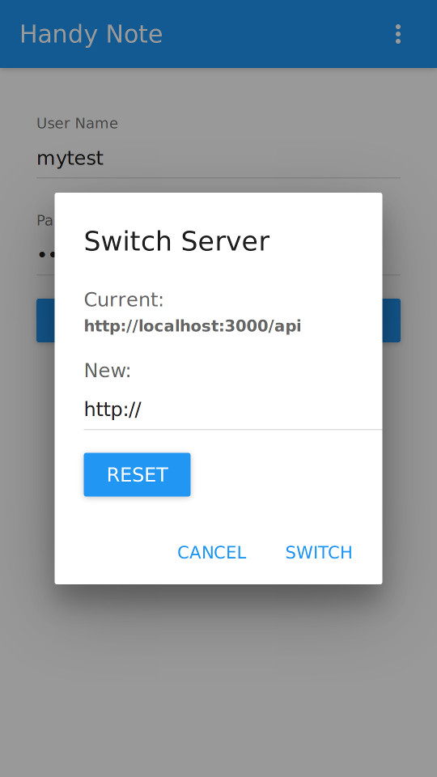

# HandyNote

HandyNote provide full stack open source solution for personal knowledge management. It contains the following independent repository:

- [HandyNote](https://github.com/jinkebj/HandyNote) - Overall info & release wrapper for HandyNote

- [HandyNote-Service](https://github.com/jinkebj/HandyNote-Service): Server solution for HandyNote, provide restful/streaming API support

- [HandyNote-Web](https://github.com/jinkebj/HandyNote-Web): Web portal for HandyNote, support most modern browser include firefox / safari / chrome / edge

- [HandyNote-Mobile](https://github.com/jinkebj/HandyNote-Mobile): Android & iOS app for HandyNote

- [HandyNote-Desktop](https://github.com/jinkebj/HandyNote-Desktop): Desktop app for HandyNote, support Mac / Linux / Windows **(NOT started yet)**

## Features

- 100% control on your personal data (support private cloud or self-hosted server)

- Access anywhere (windows/linux/mac web browser, android, ios)

- Sync data across all endpoint (web browser, android phone, iPhone)

- Uniform UI for Android & iOS, compliance with Material Design

- Catch image file in notes (referenced or embedded) to HandyNote server automatically

- In-place image edit support (zoom, rotate, corp)

## Screenshots for Web Portal

**Login Page**


**Edit Note**


**One Column View**


**Two Column View**


**Three Column View**


**Move Note**


**Edit Folder**


**Edit Note Image**


## Screenshots for Android app

&nbsp;&nbsp;&nbsp;
&nbsp;&nbsp;&nbsp;
<br>

&nbsp;&nbsp;&nbsp;
&nbsp;&nbsp;&nbsp;
<br>

&nbsp;&nbsp;&nbsp;
<br>

## Screenshots for iOS app

&nbsp;&nbsp;&nbsp;
&nbsp;&nbsp;&nbsp;
<br>

&nbsp;&nbsp;&nbsp;
&nbsp;&nbsp;&nbsp;
<br>

## Setup your own HandyNote in 10 minutes

#### 1. Install [MongoDB 3.2 or above](https://www.mongodb.com) and create initial data
```
a. run mongodb without authenticate
    mongod --dbpath /data/mongodata &
```
```
b. connect with mongo client to create HandyNote user
    mongo
    use HandyNote
    db.users.save({_id:"mytest",password:"xxxxx",usn:1})
    exit
```

#### 2. Install [Node.js 8.x or above](https://nodejs.org)

#### 3. Download [HandyNote release file](https://github.com/jinkebj/HandyNote/raw/master/release/handynote.zip), unzip it to /data/HandyNote and run following cmd:
```
cd /data/HandyNote
npm install --production
npm start
```
##### Note: [HandyNote release file](https://github.com/jinkebj/HandyNote/raw/master/release/handynote.zip) is only for test purpose, for production use, please run mongodb without authentication to create mongodb user, then run mongod with --auth and build your own release file according to section ["Build & Release"](https://github.com/jinkebj/HandyNote#build--release)
```
a. run mongodb without authentication and create mongodb user
    mongo
    use HandyNote
    db.createUser({
        "user": "handy",
        "pwd": "xxxxx",
        "roles": [
            {
                "role" : "readWrite",
                "db" : "HandyNote"
            }
        ]
        })
    exit
```
```
b. stop mongodb and restart with authentication
    mongo
    use admin
    db.shutdownServer()
    exit
    mongod --dbpath /data/mongodata --auth &
```

#### 4. Visit http://your_ip:9080, login with HandyNote user created in Step 1

#### 5. For android phone, install [HandyNote android app](https://github.com/jinkebj/HandyNote/raw/master/release/handynote-android.apk), on login page -> switch server -> input HandyNote service url with format http://your_ip:3000/api and press "SWITCH" button

&nbsp;&nbsp;&nbsp;
<br>

#### 6. For iPhone, the HandyNote app has not published to apple app store yet, but you can follow https://github.com/jinkebj/HandyNote-Mobile/blob/master/README.md#debug-on-ios to install debug version on your iPhone for test

## Build & Release

``` bash
# Optional, set npm mirror to speed up npm install in China
npm config set registry https://registry.npm.taobao.org

# install dependencies
npm install

# set HANDYNOTE_SERVICE_API, HANDYNOTE_MONGO_URL & HANDYNOTE_STATIC_ROOT
# if not set, will use:
#     HANDYNOTE_SERVICE_API=http://localhost:3000/api
#     HANDYNOTE_MONGO_URL=mongodb://localhost/HandyNote
#     HANDYNOTE_STATIC_ROOT=./handynote-static
export HANDYNOTE_SERVICE_API=http://IP:Port/api
export HANDYNOTE_MONGO_URL=mongodb://{usr}:{pwd}@{ip}/HandyNote
export HANDYNOTE_STATIC_ROOT=/home/xxx/xxx

# build distribution file for HandyNote-Service & HandyNote-Web
npm run build

# start HandyNote-Service & HandyNote-Web as service
npm start

# stop HandyNote-Service & HandyNote-Web service
npm stop

# remove HandyNote-Service & HandyNote-Web service
npm run remove

# release zip file for HandyNote-Service & HandyNote-Web
npm run release
```
